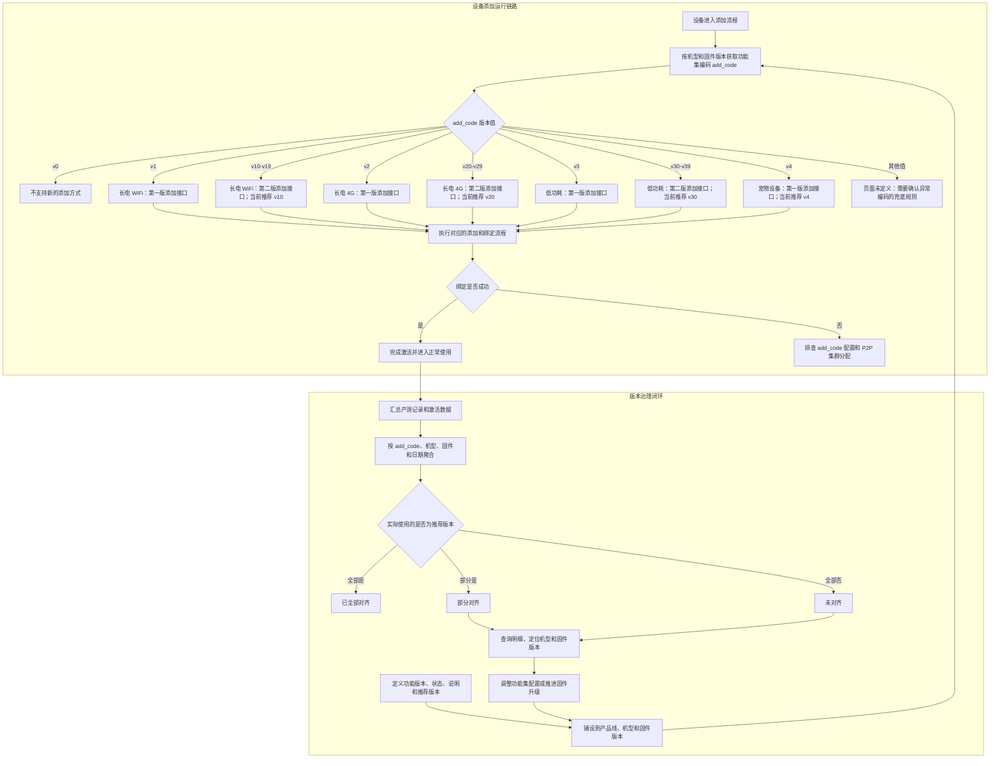

# `add_code` 功能流程梳理

来源页面：<http://192.168.252.90:5173/features/add_code>
梳理时间：2026-07-21

## 主流程图

## 版本映射

| `add_code` | 设备类型 | 添加接口 | 页面状态 | 迁移/推荐关系 |
|---|---|---|---|---|
| `v0` | 不支持添加 | 无 | 可用 | 保持 `v0` |
| `v1` | 长电 WiFi | 第一版 | 可用 | 当前推荐 `v10` |
| `v2` | 长电 4G | 第一版 | 可用 | 当前推荐 `v20` |
| `v3` | 低功耗 | 第一版 | 可用 | 当前推荐 `v30` |
| `v4` | 宠物设备 | 第一版 | 推荐 | 当前推荐 `v4` |
| `v10` | 长电 WiFi | 第二版 | 推荐 | 版本范围 `v10-v19` |
| `v20` | 长电 4G | 第二版 | 推荐 | 版本范围 `v20-v29` |
| `v30` | 低功耗 | 第二版 | 推荐 | 版本范围 `v30-v39` |

## 页面表达的管理逻辑

- 功能本身处于“启用”状态，`add_code` 同时承担“设备类型分流”和“添加接口版本选择”两层含义。
- 机型铺设视图按产品线、机型、固件版本和设备数统计覆盖范围，并按推荐版本占比标记“已全部对齐 / 部分对齐 / 未对齐”。
- 使用情况分为“产测记录”和“激活数据”，支持近 7 天、近 30 天观察，用于发现仍在流转的旧版本。
- 页面明确提示：生产和激活理论上都应使用最新推荐版本；错误配置可能造成批量添加失败或 P2P 集群分配异常。
- “物模型”页签目前只显示“属性、服务与事件”的说明，未展示具体配置内容。

## 当前数据快照

- 覆盖 6 个产品线、171 个机型、1,656 个固件版本、6,629,195 台设备。
- 167 个机型存在非推荐版本，需要继续对齐。
- 推荐版 `v30` 当前覆盖 2 个机型、3 个固件版本、58 台设备；大量低功耗机型仍在使用 `v3`。

## 需要进一步确认

1. `v11-v19`、`v21-v29`、`v31-v39` 是预留号段，还是已经存在不同业务语义的版本。
2. `add_code` 缺失、为空或落在已定义范围之外时，客户端和服务端各自采用什么兜底策略。
3. 宠物设备是否长期固定使用 `v4`，还是后续也会引入第二版添加接口。
4. 使用明细中同一固件 `23.220.205.13` 在不同日期出现“最新版本”和“版本落后，最新 23.220.205.3”两种标记，需要确认固件版本比较规则及其时间口径。
